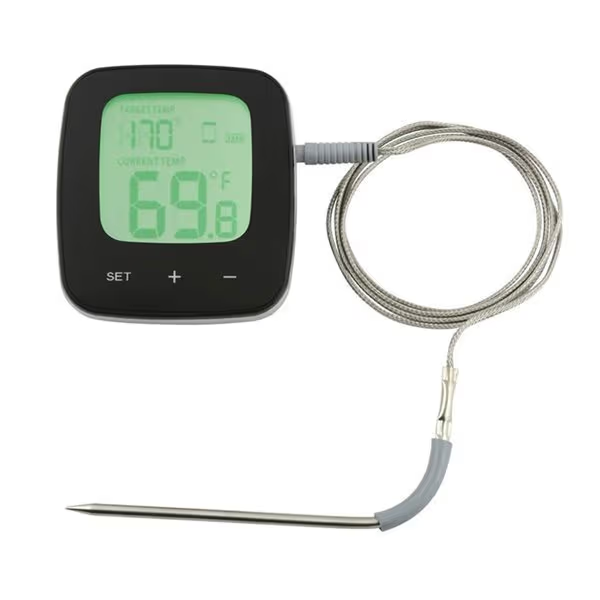

# GrillSense



Open-source Rust CLI for the GrillSense / Dangrill / Ezon / Prograde WiFi BBQ thermometer.
Reverse-engineered from the Android app — no vendor cloud required.

## What it does

Reads live temperatures from the thermometer and publishes them to
Home Assistant via MQTT. Can work fully local (no cloud), through the
vendor cloud, or as a transparent proxy that keeps the official app working
while also feeding Home Assistant.

```
┌──────────┐          ┌────────────┐   UDP :17000   ┌──────────────────┐
│  Phone   │          │ Thermometer│───────────────►│  Cloud (optional) │
│  (App)   │          └─────┬──────┘                └──────────────────┘
└──────────┘                │                               ▲
                            │ UDP :17000                    │
                            ▼                               │
                   ┌────────────────┐   forward (optional)  │
                   │  grillsense    │───────────────────────┘
                   │  (this tool)   │
                   └───────┬────────┘
                           │ MQTT
                           ▼
                   ┌────────────────┐
                   │ Home Assistant │
                   └────────────────┘
```

## Operating modes

### Cloud-only

Monitor temperatures via the vendor cloud API. The thermometer keeps
talking to `smartserver.emaxtime.cn` as usual, and the official app works
normally. No device reconfiguration needed.

```
Thermometer ──UDP──► Cloud ◄──HTTPS── grillsense cloud monitor
                                              │
                                              └──► MQTT ──► Home Assistant
```

**Tradeoffs:** Requires internet. Depends on vendor servers staying up.
No registration needed for temperature reads (only the device ID).

### Hybrid proxy

Point the thermometer at a local proxy which forwards everything to the
cloud and back. The official app still works, and grillsense taps the
data stream locally.

```
Thermometer ──UDP──► grillsense local proxy ──UDP──► Cloud
                           │          ▲
                           │          └── cloud echo forwarded back
                           └──► MQTT ──► Home Assistant
```

**Tradeoffs:** Official app works only while the proxy is running.
Requires one-time device reconfiguration (see [Setup](#reconfigure-the-device)).

### Local-only

Point the thermometer at the local proxy with cloud forwarding disabled.
Fully private, no internet or cloud account needed.

```
Thermometer ──UDP──► grillsense local proxy --no-forward
                           │
                           └──► MQTT ──► Home Assistant
```

**Tradeoffs:** Official app will not work. Bring your own frontend
(Home Assistant dashboards, Grafana, etc).

## Quick start

```sh
cargo build --release
```

### Discover the device on your LAN

```sh
grillsense local discover
```

### Read temperature from the cloud (no account needed)

```sh
# Use the WiFi MAC from discovery
grillsense cloud monitor --mac AA:BB:CC:44:55:66
```

### Run local-only with MQTT (no cloud)

```sh
# 1. Reconfigure the device to point at your machine
grillsense local configure --ip <device-ip> --ssid <ssid> -P <wifi-pass> \
    --server <your-ip>

# 2. Start the local monitor with MQTT
grillsense local monitor --mqtt --mqtt-host <broker-ip>
```

### Run the local proxy with MQTT (keeps cloud working)

```sh
grillsense local proxy --mqtt --mqtt-host <broker-ip>
```

Home Assistant auto-discovers the thermometer via MQTT (2 temperature
sensors, connectivity status, and more).

## Commands

### Cloud commands

| Command | Description |
|---------|-------------|
| `cloud login` | Authenticate with the vendor cloud |
| `cloud devices` | List devices bound to your account |
| `cloud monitor` | Poll temperature from the cloud API (+ optional MQTT) |
| `cloud set-alarm` | Set the alarm threshold via the cloud |

### Local commands

| Command | Description |
|---------|-------------|
| `local discover` | Find devices on the LAN via UDP broadcast |
| `local info` | Query device firmware and config via AT commands |
| `local configure` | Reconfigure WiFi and server settings |
| `local proxy` | Bidirectional UDP proxy (+ optional MQTT) |
| `local monitor` | Receive and display temperatures directly (+ optional MQTT) |
| `local set-alarm` | Set the device buzzer alarm via UDP |

## Reconfigure the device

The thermometer ships pointed at `smartserver.emaxtime.cn:17000`. To use
local or proxy mode, redirect it to your machine:

```sh
grillsense local configure \
    --ip <device-ip> \
    --ssid <your-ssid> \
    -P <wifi-password> \
    --server <your-machine-ip>
```

This sends AT commands over the LAN to the device's HF-LPT230 WiFi
module. The device reboots and starts sending UDP packets to your machine.

To restore cloud operation, run the same command with
`--server smartserver.emaxtime.cn`.

## Protocol

The full reverse-engineered protocol is documented in
[PROTOCOL.md](PROTOCOL.md), covering:

- BLE provisioning (GATT service, AT command sequence)
- LAN discovery and AT command interface
- Cloud REST API (login, devices, temperature, alarm)
- UDP binary protocol (18-byte temperature packets, 16-byte alarm packets)
- Device ID derivation (`devmac = "02" + wifi_mac[4:]`)
- Checksum algorithm

## Home Assistant add-on

### Install

1. In Home Assistant go to **Settings → Apps → ⋮ → Repositories**
2. Add this repository URL:

   ```
   https://github.com/bjornwein/ha-apps
   ```

3. Refresh — **GrillSense Thermometer** appears in the app list
4. Click it, then **Install**

Or click here to add the repository automatically:

[](https://my.home-assistant.io/redirect/supervisor_add_addon_repository/?repository_url=https%3A%2F%2Fgithub.com%2Fbjornwein%2Fha-apps)

### Configure

On the **Configuration** tab choose your operating mode:

| Option | Description |
|--------|-------------|
| `mode` | `local` (device sends UDP directly) or `cloud` (poll vendor API) |
| `udp_port` | UDP port the device targets (default `17000`, local mode only) |
| `device_name` | Name shown in Home Assistant |
| `cloud_email` / `cloud_password` | Vendor account (cloud mode only) |

MQTT credentials are auto-detected from the Mosquitto add-on.
Override with `mqtt_host` / `mqtt_user` / `mqtt_pass` if needed.

**Start** the add-on. Temperature entities appear automatically via
MQTT discovery.

### What gets created in HA

- **6 temperature sensors** (CH1–CH6)
- **1 binary sensor** (device online/offline)
- **2 number entities** (alarm setpoint CH1/CH2, 0–300 °C)

## Hardware

- **Thermometer**: Dangrill / GrillSense / Ezon / Prograde WiFi BBQ (2-channel)
- **WiFi module**: Hi-Flying HF-LPT230, firmware v4.12.17
- **Connectivity**: BLE 4.0 (provisioning) + WiFi 802.11 b/g/n (data)
- **Cloud**: `smartserver.emaxtime.cn` (Hong Kong)

## Dependencies

- Rust 2024 edition
- [tokio](https://tokio.rs/) — async runtime
- [clap](https://clap.rs/) — CLI argument parsing
- [reqwest](https://docs.rs/reqwest/) — HTTPS client (rustls backend)
- [serde](https://serde.rs/) / serde_json — JSON serialization
- [md-5](https://docs.rs/md-5/) — MD5 hashing (cloud auth)
- [anyhow](https://docs.rs/anyhow/) — error handling

## Roadmap

- [ ] BLE provisioning command (configure WiFi + server from CLI)
- [ ] Home Assistant config flow for all three operating modes (local, cloud, proxy)
- [ ] Auto-provisioning: discover and configure new devices from Home Assistant

## License

Licensed under either of

- Apache License, Version 2.0 ([LICENSE-APACHE](LICENSE-APACHE) or <http://www.apache.org/licenses/LICENSE-2.0>)
- MIT license ([LICENSE-MIT](LICENSE-MIT) or <http://opensource.org/licenses/MIT>)

at your option.
